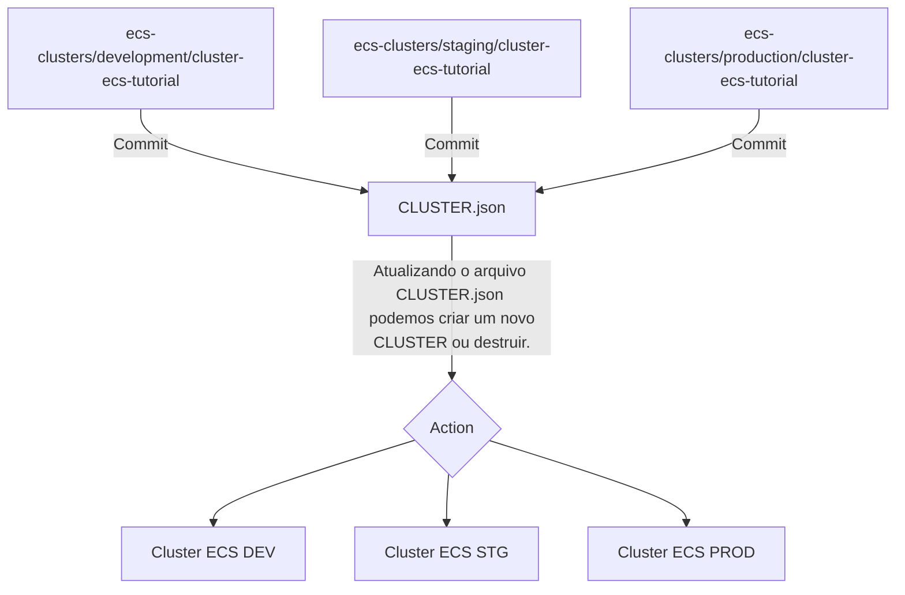

## stg-ecs

```mermaid
flowchart TD;
    A1[ecs-clusters/development/cluster-ecs-tutorial] -->|Commit| B;
    A2[ecs-clusters/staging/cluster-ecs-tutorial] -->|Commit| B;
    A3[ecs-clusters/production/cluster-ecs-tutorial] -->|Commit| B;
    B[CLUSTER.json] -->|Atualizando o arquivo CLUSTER.json <br> podemos criar um novo CLUSTER ou destruir.| C{Action}
    C --> D[Cluster ECS DEV];
    C --> E[Cluster ECS STG];
    C --> F[Cluster ECS PROD];
```